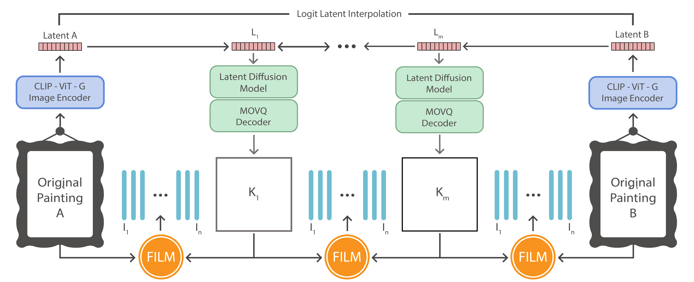

# ArtWalks via Latent Diffusion Models


We explore the creation of a dynamic bridge between between two paintings, seamlessly transitioning between artworks adding motion to static images. We build a two-stage generative process, creating both abstract-conceptual interpolation as well as spatio-temporal interpolation. We first hallucinate intermediate artworks using a generative diffusion model, then interpolate between resulting frames using a motion generation network, thus obtaining a complete video out of static paintings.

## What to expect

https://github.com/icedoom888/ArtWalks/assets/9220778/42130399-c889-4d95-a930-4b51bc3c878a

https://github.com/icedoom888/ArtWalks/assets/9220778/d00a7dec-9057-47b7-8221-d1d6cf647758


## Architecture

Our proposed method consists of a three-stage generative process.

1. **Conceptual interpolation stage**: we employ a diffusion-based image generative model [Razzhigaev et al. 2023](https://github.com/ai-forever/Kandinsky-2) to efficiently produce 𝑚 intermediate images 𝐾1 to 𝐾𝑚 situated between two reference paintings, A and B.

2. **Spatio-temporal interpolation stage**: we employ a large motion interpolation network [Reda et al. 2022](https://github.com/google-research/frame-interpolation) to generate motion sequences between A, the generated images 𝐾 and B.
    
3. **Upscaling stage**: we finally upscale our results by employing a video super-resolution model [Wang et al.](https://github.com/saba99/Video-Super-Resolution-ESRGAN) reaching a resolution of 2K. 

You can see the full pipeline in the following illustration.




## Preparations

Install ffmpeg and av dev libs

```bash
sudo apt install ffmpeg libavformat-dev libavdevice-dev
```


1. Diffusion environment
```bash
conda create -p /projects/Anaconda/envs/diff python=3.8 -y
conda activate diff
conda install cudnn -y
pip install -r requirements_total.txt --no-cache-dir
pip install -U git+https://github.com/facebookresearch/demucs#egg=demucs
export LD_LIBRARY_PATH=$LD_LIBRARY_PATH:/projects/Anaconda/envs/diff/lib/python3.8/site-packages/tensorrt_libs
pip install "git+https://github.com/ai-forever/Kandinsky-2.git"
pip install git+https://github.com/openai/CLIP.git
conda deactivate
```

2. Create Image Interpolation environemnt
```bash
conda create -n film python=3.9 -y
conda activate film
cd frame-interpolation
pip install -r requirements.txt
pip install tensorflow
conda deactivate
```

3. (Optional) Create Music environment
```bash
conda create -n music python=3.8
conda activate srmusic
pip install torch torchvideo torchaudio
pip install -U git+https://github.com/facebookresearch/demucs#egg=demucs
pip install tqdm
pip install matplotlib opencv-python librosa Ipython
conda deactivate
```


## How to Use

In order to use ArtWalks you just need to make a folder with all your favourite images.
By launching the following script you will be able to generate a 2K video with your own pictures:

```bash
bash full_pipeline.sh $INPATH $FOLDER_NAME $S $I $F $MODEL
```
Where:
 - *INPATH* : Path to the input data folder
 - *FOLDER_NAME* : Name of the folder containing the images
 - *S* : Number of images to generate with diffusion between each pair of images
 - *I* : Number of seconds that have to pass between each consecutive pair of generated images
 - *F* : Number of seconds to freeze on each original image during the video 
 - *MODEL* : Name of the diffusion model to use (unclip/kandinsky)

### Story Generator

When you have a big collection of images, you can use this tool to select a random subset of *img_num* images. 
Generate a random story from a collection of immages:

```bash
python random_story_generation.py --input_path inputdata --img_num 10
```
Where:
 - *input_path* : Path to the folder containing all subfolders of images
 - *img_num* : Number of images to randomly sample
 
### Diffusion 

You can also just generate any sequence of images between two given pictures.
Run diffusion pipeline to interpolate between every pair of images in `input_path` (It takes roughly ~10s per pair):

```bash
python diffusion_models/diffusion.py --input_path $INPATH --folder_name $FOLDER_NAME --output_path $OUTPATH --model $M --interpolation_steps $S --outpaint 
```

This script makes use of either the [UnCLIP Image Interpolation pipeline](https://github.com/huggingface/diffusers/tree/main/examples/community#unclip-image-interpolation-pipeline) or the [Kandisnky 2 model](https://github.com/ai-forever/Kandinsky-2).
Script arguments:
```python
parser.add_argument("--input_path", help="Path to folder with images",
                        type=str)
parser.add_argument("--folder_name", help="Name of the folder to read",
                    type=str)
parser.add_argument("--output_path", help="Path to the output folder",
                    type=str, default="output")
parser.add_argument("--model", help="Choose between kandinsky/unclip model", type=str, default='unclip')
parser.add_argument("--interpolation_steps", help="Number of generated frames between a pair of images",
                    type=int, default=5)
parser.add_argument("--square_crop", help="If active, crops the images in a square.", action="store_true")
parser.add_argument("--no_originals", help="If active, don't save original images.", action="store_true")
parser.add_argument("--no_originals", help="If active, don't save original images.", action="store_true")
parser.add_argument("--outpaint", help="If active, outpaints the image using generative model.", action="store_true")
parser.add_argument("--h", help="Height of the generated images",type=int, default=720)
parser.add_argument("--w", help="Width of the generated images",type=int, default=1280)

```

### Frame interpolation

Generate videos interpolating between diffusion frames with (It takes roughly ~2 mins per pair):
``` bash
 python generate_videos_alpha.py --input_path output --folder_name $FOLDER_NAME --sec_interpolation $I --sec_freeze $F --clean
```

```generate_videos_alpha.py``` will produce videos with a non-linear acceleration between frames. 

```generate_videos.py``` will produce videos with a linear interpolation speed between frames.

Script arguments:
```python
parser.add_argument("--input_path", help="Path to folder with images", default='output',
                    type=str)
parser.add_argument("--folder_name", help="Name of the folder to read",
                    type=str)
parser.add_argument("--sec_interpolation", help="Number of seconds to interpolate between images", type=int, default=10)
parser.add_argument("--sec_freeze", help="Number of seconds to freeze per original image", type=int, default=20)
parser.add_argument("--clean", help="Delete everything but the final video", action='store_true')
```

### Video Super Resolution
Generate up to 4K video by using [Video Super Resolution ESRGAN](https://github.com/saba99/Video-Super-Resolution-ESRGAN/tree/master)

```bash
python inference_realesrgan_video.py -n RealESRGAN_x4plus -i ../output/$FOLDER_NAME/final_video.mp4 -o ../output/$FOLDER_NAME/ -s $sr
```

Script arguments:
```python
parser.add_argument('-i', '--input', type=str, default='inputs', help='Input video, image or folder')
parser.add_argument(
    '-n',
    '--model_name',
    type=str,
    default='realesr-animevideov3',
    help=('Model names: realesr-animevideov3 | RealESRGAN_x4plus_anime_6B | RealESRGAN_x4plus | RealESRNet_x4plus |'
            ' RealESRGAN_x2plus | realesr-general-x4v3'
            'Default:realesr-animevideov3'))
parser.add_argument('-o', '--output', type=str, default='results', help='Output folder')
parser.add_argument(
    '-dn',
    '--denoise_strength',
    type=float,
    default=0.5,
    help=('Denoise strength. 0 for weak denoise (keep noise), 1 for strong denoise ability. '
            'Only used for the realesr-general-x4v3 model'))
parser.add_argument('-s', '--outscale', type=float, default=4, help='The final upsampling scale of the image')
parser.add_argument('--suffix', type=str, default='out', help='Suffix of the restored video')
parser.add_argument('-t', '--tile', type=int, default=0, help='Tile size, 0 for no tile during testing')
parser.add_argument('--tile_pad', type=int, default=10, help='Tile padding')
parser.add_argument('--pre_pad', type=int, default=0, help='Pre padding size at each border')
parser.add_argument('--face_enhance', action='store_true', help='Use GFPGAN to enhance face')
parser.add_argument(
    '--fp32', action='store_true', help='Use fp32 precision during inference. Default: fp16 (half precision).')
parser.add_argument('--fps', type=float, default=None, help='FPS of the output video')
parser.add_argument('--ffmpeg_bin', type=str, default='ffmpeg', help='The path to ffmpeg')
parser.add_argument('--extract_frame_first', action='store_true')
parser.add_argument('--num_process_per_gpu', type=int, default=1)

parser.add_argument(
    '--alpha_upsampler',
    type=str,
    default='realesrgan',
    help='The upsampler for the alpha channels. Options: realesrgan | bicubic')
parser.add_argument(
    '--ext',
    type=str,
    default='auto',
    help='Image extension. Options: auto | jpg | png, auto means using the same extension as inputs')
```
