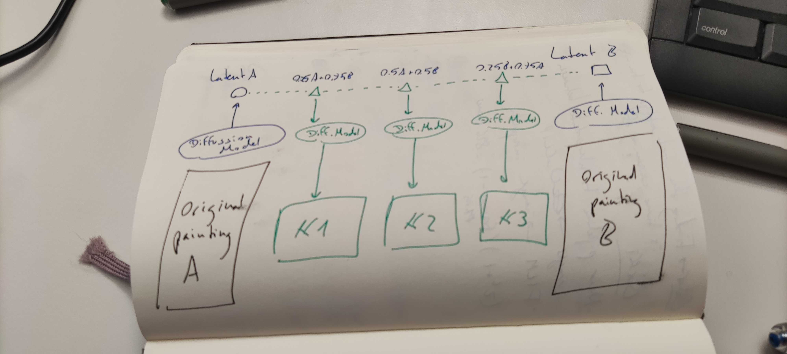
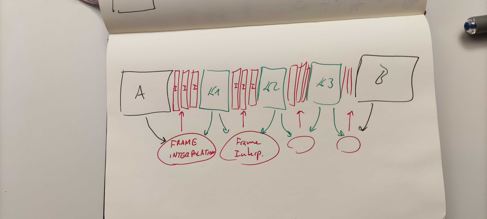

# Diffusion-Videos

[[_TOC_]]

## Architecture

Generate intermidiate frames with stable diffusion:


Interpolate between all frames (original and generated) with FILM:



## Preparations

Install ffmpeg and av dev libs

```bash
sudo apt install ffmpeg libavformat-dev libavdevice-dev
```

1. Clone repo:
```bash
git clone git@gitlab.ethz.ch:mtc/special_project.git
cd frame-interpolation
git submodule init
git submodule update
cd ..
```

2. Create diffusers environemnt
```bash
conda create -n diffusers python=3.10 -y
conda activate diffusers
pip install -r requirements.txt
conda deactivate
```

3. Create FILM environemnt
```bash
conda create -n film python=3.9 -y
conda activate film
cd frame-interpolation
pip install -r requirements.txt
pip install tensorflow
conda deactivate
```

4. Create SR environment
```bash
conda create -n sr python=3.9
conda activate sr
pip install basicsr
# facexlib and gfpgan are for face enhancement
pip install facexlib
pip install gfpgan
pip install -r requirements.txt
conda deactivate
```

## Full Pipeline

You can run the full pipeline using the following command:
```bash
bash full_pipeline.sh $INPATH $FOLDER_NAME $S $I $F
```
Where:
 - *INPATH* : Path to the input data folder
 - *FOLDER_NAME* : Name of the folder containing the images
 - *S* : Number of images to generate with diffusion between each pair of images
 - *I* : Number of interpolation images to generate between each pair of generated images
 - *F* : Number of seconds to freeze on each original image during the video 

## Usage

1. Run unCLIP pipeline to interpolate between every pair of images in `input_path` (It takes roughly ~10s per pair):

    ```bash
    python unclip.py --input_path ../mtc-gtc/ --folder_name Story_A
    ```

    This script makes use of the [UnCLIP Image Interpolation pipeline](https://github.com/huggingface/diffusers/tree/main/examples/community#unclip-image-interpolation-pipeline). It takes every image in the input_path, [natsort](https://github.com/SethMMorton/natsort/wiki/How-Does-Natsort-Work%3F) it and create n interpolations between every pair of images. Script arguments:
    ```python
    parser.add_argument("--input_path", help="Path to folder with images",
                            type=str)
    parser.add_argument("--folder_name", help="Name of the folder to read",
                        type=str)
    parser.add_argument("--output_path", help="Outputs path",
                        type=str, default="output")
    parser.add_argument("--glob_pattern", help="Pattern to find files",
                        type=str, default="**/*.") 
    parser.add_argument("--interpolation_steps", help="Number of generated frames between a pair of images",
                        type=int, default=5)
    parser.add_argument("--max_image_size", help="Max image size",
                        type=int, default=256) # This needs to be fixed to 256 because the model outputs are fixed to 256x256
    parser.add_argument("-D", help="Debug",
                        action="store_true")
    ```

2. Generate videos with (It takes roughly ~2 mins per pair):
    ```bash
    python generate_videos.py --input_path output --folder_name Story_A --sec_interpolation 10 --sec_freeze 20 # --clean

    ```

    Script arguments:
    ```python
    parser.add_argument("--input_path", help="Path to folder with images", default='output',
                        type=str)
    parser.add_argument("--folder_name", help="Name of the folder to read",
                        type=str)
    parser.add_argument("--sec_interpolation", help="Number of seconds to interpolate between images", type=int, default=10)
    parser.add_argument("--sec_freeze", help="Number of seconds to freeze per original image", type=int, default=20)
    parser.add_argument("--clean", help="Delete everything but the final video", action='store_true')
    ```

3. Generate 2K video by using [Video Super Resolution ESRGAN](https://github.com/saba99/Video-Super-Resolution-ESRGAN/tree/master)

    ```bash
    python inference_realesrgan_video.py -n RealESRGAN_x4plus -i ../output/Story_A/final_video.mp4 -o ../output/Story_A/ -s 8
    ```

    Script arguments:
    ```python
    parser.add_argument('-i', '--input', type=str, default='inputs', help='Input video, image or folder')
    parser.add_argument(
        '-n',
        '--model_name',
        type=str,
        default='realesr-animevideov3',
        help=('Model names: realesr-animevideov3 | RealESRGAN_x4plus_anime_6B | RealESRGAN_x4plus | RealESRNet_x4plus |'
              ' RealESRGAN_x2plus | realesr-general-x4v3'
              'Default:realesr-animevideov3'))
    parser.add_argument('-o', '--output', type=str, default='results', help='Output folder')
    parser.add_argument(
        '-dn',
        '--denoise_strength',
        type=float,
        default=0.5,
        help=('Denoise strength. 0 for weak denoise (keep noise), 1 for strong denoise ability. '
              'Only used for the realesr-general-x4v3 model'))
    parser.add_argument('-s', '--outscale', type=float, default=4, help='The final upsampling scale of the image')
    parser.add_argument('--suffix', type=str, default='out', help='Suffix of the restored video')
    parser.add_argument('-t', '--tile', type=int, default=0, help='Tile size, 0 for no tile during testing')
    parser.add_argument('--tile_pad', type=int, default=10, help='Tile padding')
    parser.add_argument('--pre_pad', type=int, default=0, help='Pre padding size at each border')
    parser.add_argument('--face_enhance', action='store_true', help='Use GFPGAN to enhance face')
    parser.add_argument(
        '--fp32', action='store_true', help='Use fp32 precision during inference. Default: fp16 (half precision).')
    parser.add_argument('--fps', type=float, default=None, help='FPS of the output video')
    parser.add_argument('--ffmpeg_bin', type=str, default='ffmpeg', help='The path to ffmpeg')
    parser.add_argument('--extract_frame_first', action='store_true')
    parser.add_argument('--num_process_per_gpu', type=int, default=1)

    parser.add_argument(
        '--alpha_upsampler',
        type=str,
        default='realesrgan',
        help='The upsampler for the alpha channels. Options: realesrgan | bicubic')
    parser.add_argument(
        '--ext',
        type=str,
        default='auto',
        help='Image extension. Options: auto | jpg | png, auto means using the same extension as inputs')
    ```

## `variations.py`

This is another pipeline I've been experimenting with is based on the ImageVariationPipeline([more info here](https://huggingface.co/lambdalabs/sd-image-variations-diffusers)) and the [Stable Diffusion Interpolation](https://github.com/huggingface/diffusers/tree/main/examples/community#stable-diffusion-interpolation) (only text based, which was adapted to accept two images as input and interpolate between them). It has everything already integrated to go from frames to videos, but without inter-frame interpolation using FILM. Results are pretty cool but I found that they are a bit worse than the unclip pipeline.

## Future steps

There are different lines to follow and finish the project:
- We can experiemnt doing inter-frame interpolation with FILM before or after superresolution.
- Fine-tuning stable diffusion model on the style of the artist: https://huggingface.co/docs/diffusers/training/dreambooth
- Explore other methods like prompt-to-prompt: https://github.com/google/prompt-to-prompt/


## Music

```bash
ffmpeg -i <INPUT-VIDEO> -stream_loop -1 -i assets/horror_music.mp3 -shortest -map 0:v:0 -map 1:a:0 -c:v copy output.mp4
```
> Note: Works iif the video is longer than the audio
